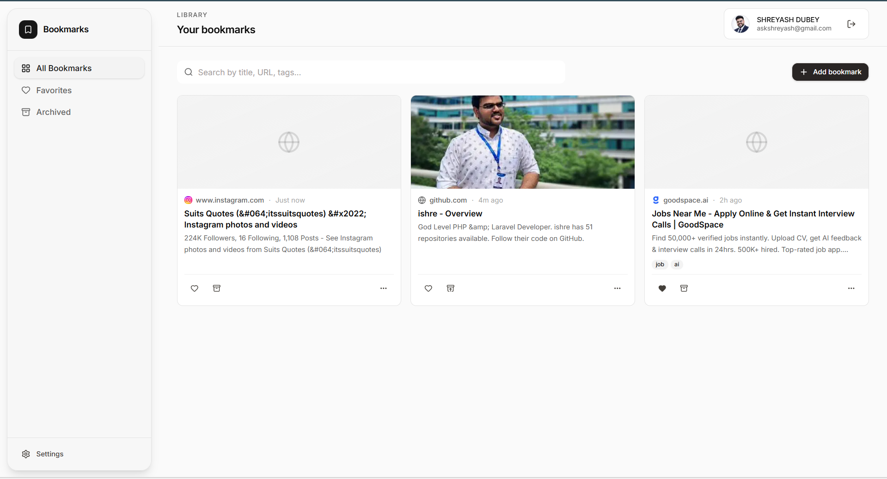
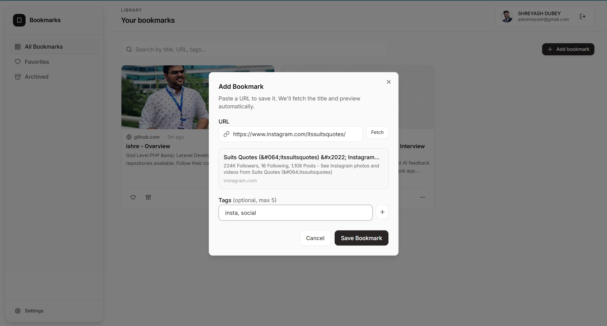

## Smart Bookmark Manager

A modern, real‑time bookmark manager built with Next.js and Supabase.  
Save links, fetch rich metadata and preview images, organize them with tags, and browse everything in a responsive, dashboard‑style UI.

This document explains what the project does, how the code is structured, which technologies it uses, and how to run it locally. Code blocks are annotated so you always know what they are doing and when to use them.

---

### Screenshots

These screenshots are stored under `public/screenshots` and are referenced here using paths relative to the project root.

- **Dashboard / homepage**

  

  This shows the main dashboard view with the sidebar, search, and bookmark grid. Each card renders favicon, title, description, tags, and actions (favorite, archive, delete, open).

- **Add bookmark modal**

  

  This modal is used to create a new bookmark. Once you paste a URL or blur the URL field, the app calls a server‑side metadata route, extracts title/description/image/favicon, and pre‑fills the form.

---

### Features

- **Google OAuth authentication** via Supabase Auth.
- **Bookmark CRUD**: add, update, soft‑delete/archive, and favorite bookmarks.
- **Metadata fetching**: server‑side endpoint that scrapes the target page for Open Graph / Twitter tags and favicon.
- **OG/social preview images in cards**: cards call the metadata endpoint to display link preview images where available, with graceful fallbacks.
- **Realtime updates**: Supabase Realtime keeps bookmarks in sync across tabs.
- **Search & filter**: fuzzy search across title, URL, description, and tags; views for all, favorites, and archived.
- **Dark / light theme** powered by `next-themes`.
- **Responsive UI**: sidebar layout on desktop, sensible grid on smaller screens.

---

### Tech stack

- **Framework**: Next.js 14+ (App Router, TypeScript, server and client components)
- **Language**: TypeScript with explicit types for props, hooks, and Supabase rows
- **Styling**:
  - Tailwind CSS (via `@import "tailwindcss";` in `app/globals.css`)
  - Design tokens using CSS variables and OKLCH color space
  - Custom scrollbar styling
- **UI components**:
  - `shadcn/ui` primitives (buttons, dialogs, dropdowns, inputs, etc.)
  - Custom components such as `bookmark-card`, `bookmark-grid`, `search-bar`, `sidebar`, `user-menu`
- **State & interaction**:
  - React hooks (`useState`, `useEffect`, `useMemo`, `useCallback`)
  - `framer-motion` for list and card animations
  - `sonner` for toast notifications
- **Auth & data**:
  - Supabase PostgreSQL database (`bookmarks`, `user_preferences` tables)
  - Supabase Auth (Google OAuth)
  - Supabase Realtime for live bookmark updates
- **Misc**:
  - `lucide-react` icon set
  - `next-themes` for theme switching
  - `lodash/debounce` for debounced search

---

### Project structure (high‑level)

Key directories and what they hold:

- **`app/`**
  - `layout.tsx`: root layout, metadata (including Open Graph/Twitter), global providers.
  - `page.tsx`: redirects to `/dashboard`.
  - `(auth)/…`: login and callback flows for Supabase/Google.
  - `(dashboard)/layout.tsx`: dashboard shell with sidebar and header.
  - `(dashboard)/dashboard/page.tsx`: all bookmarks view.
  - `(dashboard)/favorites/page.tsx`: favorites view.
  - `(dashboard)/archived/page.tsx`: archived view.
  - `api/bookmarks/*`: REST API routes for bookmarks CRUD (used by server actions and hooks).
  - `api/metadata/route.ts`: server‑side metadata scraper used for fetching title/description/image/favicon from a URL.

- **`components/`**
  - `bookmark-card.tsx`: visual card for a single bookmark with preview area, favicon, title, description, tags, and action buttons.
  - `bookmark-grid.tsx`: grid layout, search integration, empty states, and connection to `useBookmarks` hook.
  - `add-bookmark-dialog.tsx`: modal that lets the user paste a URL, automatically fetches metadata, and submits a new bookmark.
  - `sidebar.tsx`: navigation and theme switching.
  - `user-menu.tsx`, `empty-state.tsx`, `search-bar.tsx`, etc.
  - `ui/`: shadcn UI primitives (button, dialog, input, etc.).

- **`lib/`**
  - `supabase/client.ts`: browser‑side Supabase client (uses env vars).
  - `supabase/server.ts`: server‑side Supabase client.
  - `hooks/use-bookmarks.ts`: realtime bookmark hook (fetch, insert, update, delete, visit).
  - `hooks/use-search.ts`: client‑side searching, deduping, and view‑based filtering.
  - `types/database.types.ts`: generated Supabase types, including the `bookmarks` row shape.
  - Helper utilities for dates, className composition, URL validation, etc.

- **`public/screenshots/`**
  - `homepage-dashboard.png`: screenshot of the main dashboard UI.
  - `modal-popup-to-add-bookmark.png`: screenshot of the add‑bookmark modal.

---

### Running the project locally

This section explains each command, what it does, and when to use it.

#### 1. Clone the repository

```bash
git clone <your-repo-url>
cd bookmark-app
```

- The `git clone` command copies the repository to your machine.
- `cd bookmark-app` moves into the project directory so subsequent commands run against the correct project.

#### 2. Install dependencies

```bash
npm install
```

- Installs all runtime and development dependencies declared in `package.json`.
- You only need to run this once after cloning or when dependencies change.

If you prefer another package manager, you can use:

```bash
yarn install
pnpm install
# or
bun install
```

Make sure you are consistent and do not mix multiple package managers in the same clone.

#### 3. Configure environment variables

Create a `.env.local` file in the project root. At minimum you will need:

```bash
NEXT_PUBLIC_SUPABASE_URL=your-supabase-url
NEXT_PUBLIC_SUPABASE_ANON_KEY=your-supabase-anon-key
SUPABASE_SERVICE_ROLE_KEY=your-service-role-key
NEXT_PUBLIC_APP_URL=http://localhost:3000
```

- `NEXT_PUBLIC_SUPABASE_URL` and `NEXT_PUBLIC_SUPABASE_ANON_KEY` are used by the browser and server to talk to Supabase.
- `SUPABASE_SERVICE_ROLE_KEY` is used for privileged server‑side operations (keep this secret).
- `NEXT_PUBLIC_APP_URL` is used in `app/layout.tsx` as `metadataBase` so social share images resolve with the proper origin.

You can copy from `.env.example` (if present) as a starting point.

#### 4. Set up the database on Supabase

In your Supabase project, apply the schema from the PRD (or your migrations), including:

- `bookmarks` table with fields like `url`, `title`, `description`, `favicon_url`, `domain`, `tags`, `view_count`, `is_favorite`, `is_archived`, timestamps, and optional `position_x / position_y`.
- `user_preferences` table for theme and view defaults.
- RLS policies that scope rows to `auth.uid()`.
- Realtime publication:

```sql
ALTER PUBLICATION supabase_realtime ADD TABLE bookmarks;
```

This ensures the `useBookmarks` hook receives realtime events.

#### 5. Run the development server

```bash
npm run dev
```

This command:

- Builds the app in development mode.
- Starts a Next.js dev server on `http://localhost:3000` (or the port configured in your environment).
- Enables hot reloading so edits you make in the code show up almost immediately in the browser.

Visit `http://localhost:3000` in your browser to sign in with Google and use the app.

#### 6. Run a production build (optional, but recommended)

```bash
npm run build
npm run start
```

- `npm run build` creates an optimized production build (minified JavaScript, optimized bundles, precomputed metadata).
- `npm run start` launches the production server using the built assets, which is closer to how the app will behave in a real deployment.

Use this flow when you want to validate that everything works in production mode before deploying to Vercel or another platform.

---

### Metadata and preview images

Metadata and social preview images are handled in two main places:

- **Server‑side metadata route:** `app/api/metadata/route.ts`
  - Receives a `url` query parameter.
  - Fetches the target page on the server (avoiding CORS issues in the browser).
  - Extracts:
    - `og:title`, `twitter:title`, or `<title>` as the fallback title.
    - `og:description` or `meta[name="description"]` as description.
    - `og:image` or Twitter card image as the preview.
    - favicon from `<link rel="icon">` or falls back to a Google S2 favicon URL.
  - Returns a JSON payload the client can consume.

- **Client‑side usage in components:**
  - `add-bookmark-dialog.tsx`:
    - Calls `/api/metadata` when you paste a URL, blur the URL field, or explicitly click the refetch button.
    - Fills in title, description, favicon, and domain before saving the bookmark.
  - `bookmark-card.tsx`:
    - Calls `/api/metadata` when rendering each bookmark to retrieve any available preview image.
    - Displays the image at the top of the card using a plain `` tag.
    - Falls back to a gradient/globe illustration when the image is missing or fails to load.

All external HTML fetching happens on the server. The browser only ever requests raw image URLs, which greatly reduces CORS exposure and keeps scraped metadata away from client‑side JavaScript.

---

### Realtime behavior

The `lib/hooks/use-bookmarks.ts` hook:

- Fetches bookmarks for the current authenticated Supabase user.
- Subscribes to `postgres_changes` on the `bookmarks` table.
- Applies optimistic updates on insert/delete and rolls back on error.
- Reflects inserts, updates, and deletes in all open tabs for the same user when Realtime is enabled in Supabase.

To ensure this works:

- The `bookmarks` table must be added to the `supabase_realtime` publication.
- RLS must allow the `anon` role to receive events for the rows the user can see.

---

### Deployment

The app is designed to be deployed to **Vercel**, but any environment that supports Next.js 14 with Node.js and the App Router will work.

High‑level deployment steps:

1. Push your code to a Git repository (GitHub, GitLab, etc.).
2. Create a new project on Vercel and import the repository.
3. Set the same environment variables used in `.env.local` in the Vercel dashboard.
4. Deploy; Vercel will run `npm install`, `npm run build`, and serve the production build.

For other platforms, consult their Next.js deployment guides and map the build and start commands accordingly.

---

### Contributing / extending

The codebase is structured to be easy to extend. Some natural next steps:

- Add a browser extension for one‑click bookmarking.
- Support import/export from the browser’s native bookmarks.
- Add collections or shared lists between users.
- Persist and display more advanced analytics such as view history over time.

If you modify or extend the app, consider updating this README with new commands, environment variables, and screenshots so future readers can quickly understand how everything fits together.

---

### Problems I faced and how I solved them

This section documents a few non‑obvious issues and how they were resolved. The goal is to save you time if you run into similar behavior.

#### 1. Stuck in a login loop on Vercel

**Symptom:** In production, after signing in with Google, the app immediately redirected back to the `/login` page instead of the dashboard.

**Root cause:** The Supabase client in `middleware.ts` and `lib/supabase/server.ts` reads `NEXT_PUBLIC_SUPABASE_URL` and `NEXT_PUBLIC_SUPABASE_ANON_KEY`. On Vercel, these were either not set or did not match the Supabase project used locally, so `supabase.auth.getUser()` always returned `user: null` and the middleware treated every request as unauthenticated.

**Fix:**

1. In the Vercel project settings, configure:
   - `NEXT_PUBLIC_SUPABASE_URL`
   - `NEXT_PUBLIC_SUPABASE_ANON_KEY`
   - `SUPABASE_SERVICE_ROLE_KEY`
   - `NEXT_PUBLIC_APP_URL`
2. In the Supabase Auth settings, set:
   - **Site URL** to the deployed Vercel URL, for example `https://your-app.vercel.app`.
   - Ensure `https://your-app.vercel.app/auth/callback` is allowed as a redirect URL.
3. Redeploy the app so middleware and server clients pick up the correct environment.

After this, `supabase.auth.getUser()` in middleware started returning a valid user, and the redirect loop disappeared.

#### 2. Open Graph images and CORS / upstream failures

**Symptom:** Link preview images worked for some sites locally but broke intermittently or produced a lot of terminal noise such as:

- `upstream image response failed for ... 404`
- `... 403`

**Root cause:** When using `next/image` to load arbitrary remote images, Next.js proxies those requests through its image optimizer. Many third‑party image hosts return 403/404 for automated requests or for certain referrers, leading to noisy logs and broken previews. Additionally, making metadata requests directly from the browser ran into CORS restrictions on some sites.

**Fix:**

1. Move all metadata fetching into a server route:

   - Implemented `app/api/metadata/route.ts` that:
     - Fetches HTML on the server.
     - Parses Open Graph / Twitter tags and favicon.
     - Returns a normalized JSON payload.

2. Fetch previews from the client only against this internal API:

   - `add-bookmark-dialog.tsx` and `bookmark-card.tsx` call `/api/metadata?url=...` instead of talking to third‑party domains directly from the browser.

3. Stop using `next/image` for these arbitrary remote images:

   - Replaced preview and favicon rendering with plain `` tags.
   - This avoids the Next.js image optimizer layer that was generating most of the upstream error logs.

The result is a more predictable preview experience and far fewer noisy errors when sites respond with non‑200 status codes.

#### 3. Realtime updates not appearing in other tabs

**Symptom:** Adding or deleting bookmarks updated immediately in the current tab (thanks to optimistic client state) but did not appear or disappear in another tab until a full reload.

**Root cause:** Supabase Realtime was not enabled for the `bookmarks` table, so the `useBookmarks` subscription received no events. The hook’s logic for handling `INSERT`, `UPDATE`, and `DELETE` events was correct, but no events were ever published.

**Fix:**

1. In Supabase, enable Realtime on the `bookmarks` table either via the GUI or SQL:

   ```sql
   ALTER PUBLICATION supabase_realtime ADD TABLE bookmarks;
   ```

2. Confirm that the RLS policies allow the authenticated user to receive changes for their own rows.

Once Realtime was enabled, changes in one tab appeared in other open tabs without reloading.

#### 4. Metadata not fetching reliably when pasting URLs

**Symptom:** Pasting a URL into the “Add bookmark” modal sometimes failed to fetch metadata, especially when the user immediately tabbed away or when URLs contained special characters.

**Root cause:** The initial implementation only fetched metadata when pressing a “Fetch” button and relied on `encodeURIComponent(url)` without normalizing or validating the URL first. Race conditions between state updates and fetch calls also led to inconsistent behavior.

**Fix:**

1. Normalize and validate URLs:

   - If the user omits the scheme, the app prepends `https://`.
   - Use the `URL` constructor to validate the structure and ensure special characters are handled correctly.

2. Trigger metadata fetch automatically:

   - On `onBlur` of the URL input (if metadata has not been fetched yet).
   - Immediately on `onPaste`, using the pasted text directly so the fetch does not race against React state updates.

3. Keep a small “Refetch” button for manual retries.

This made metadata loading feel much more automatic and robust, particularly for non‑trivial URLs.


